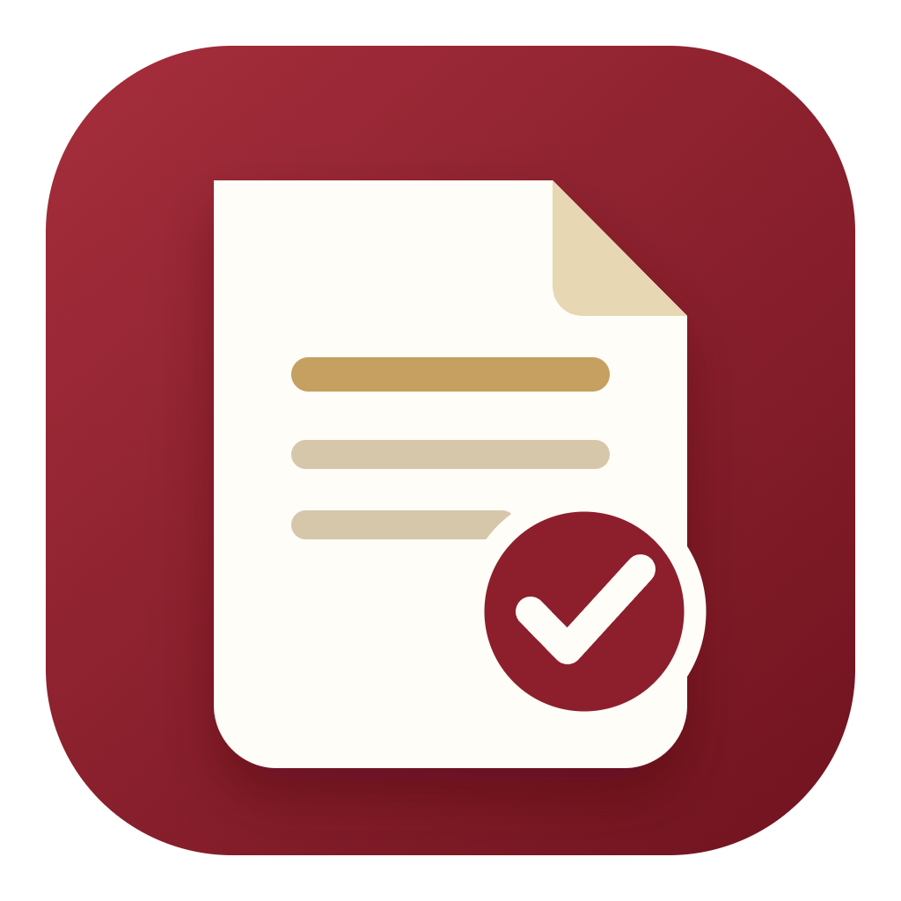
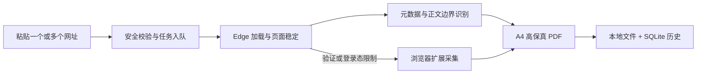

<div align="center">
  
  <h1>宣传记录助手</h1>
  <p><strong>把网页新闻与微信公众号文章，可靠地归档成可追溯、可打印的 A4 PDF。</strong></p>

  <p>
    <a href="https://ch-zhou-0512.github.io/publicity-archive-assistant/">项目展示</a> ·
    <a href="https://github.com/CH-ZHOU-0512/publicity-archive-assistant/releases/latest">下载安装</a> ·
    <a href="https://github.com/CH-ZHOU-0512/publicity-archive-assistant/wiki">使用手册</a> ·
    <a href="https://github.com/CH-ZHOU-0512/publicity-archive-assistant/discussions">交流讨论</a>
  </p>

  <p>
    
    
    
    
  </p>
</div>

宣传记录助手是一款本地运行的 Windows 网页归档工具。它不会把文章改造成千篇一律的“阅读模式”，而是尽量保留媒体品牌、标题、日期、作者、正文、原图和页面视觉关系，同时清理广告、弹窗、登录引导与推荐模块。

应用启动后通过浏览器访问本机页面，网页处理、PDF 生成、任务历史和设置均保存在当前电脑；没有云端服务，也不会把文章内容上传给第三方。

## 为什么值得用

| 能力 | 实际效果 |
| --- | --- |
| 高保真桌面网页归档 | 自动识别正文实际左右边界，兼容固定宽度、`min-width`、负边距、横向溢出和宽图，避免只按浏览器视口截图造成正文两侧丢失 |
| A4 智能分页 | 以 300 DPI 截图生成 A4 PDF，优先避开文字行切页；长图允许自然跨页，短尾页可在可读范围内自适应收紧 |
| 微信与反爬兜底 | 内置 Edge 渲染公开页面；遇到验证、登录态或反爬限制，可用随安装包提供的 Manifest V3 扩展采集浏览器中已经显示的内容 |
| 可追溯归档 | PDF 页脚保留来源域名、采集时间、页码与原文二维码，文件名采用“原标题_发布日期.pdf” |
| 稳定批处理 | 每行一个网址，任务持久化到 SQLite；单条失败不影响其他任务，支持确认元数据、重试和重启恢复 |
| 本地优先与安全边界 | 仅监听 `127.0.0.1`，使用会话校验与来源限制；只接收 `http/https`，拦截内网、回环、云元数据地址及不安全跳转 |

## 已解决的关键技术难题

1. **桌面新闻页并不等于浏览器视口。** 很多媒体站点使用 1440/1600px 固定布局、横向溢出或负边距。项目以正文及其可见子元素的联合边界计算截图范围，并加入安全留白，避免截掉左右正文。
2. **“页面加载完成”不代表内容已经稳定。** 工具会滚动触发懒加载，等待字体与图片解码，并监测页面高度稳定后再采集，不单独依赖容易误判的 `networkidle`。
3. **长网页不能简单缩成一张 A4。** 项目先按 A4 可打印区域计算切片，再用文字行边界调整切线；同时限制自适应缩放下限，避免为了少一页把正文缩得无法阅读。
4. **微信公众号与普通网页的访问条件不同。** 默认走隔离的系统 Edge；若页面要求验证或依赖现有登录态，浏览器扩展可在用户已打开的标签页内分段采集，再交回本机统一生成 PDF。
5. **归档不仅要“看起来像”，还要能证明来源。** 标题、日期、来源和作者按 JSON-LD、Open Graph、站点适配器与页面语义逐级提取；无法可靠识别时进入人工确认，而不是用采集日期冒充发布日期。

## 工作流程



## 安装与使用

1. 在 [Releases](https://github.com/CH-ZHOU-0512/publicity-archive-assistant/releases/latest) 下载 `宣传记录助手-安装程序-1.0.0.exe`。
2. 在 Windows 10/11 x64 上完成安装，桌面会创建“宣传记录助手”快捷方式。
3. 双击快捷方式，程序会用默认浏览器打开本地操作页面。
4. 每行粘贴一个新闻网址，保持“自动判断”，点击“开始处理”。
5. 任务完成后点击“查看 PDF”或“打开输出目录”。

默认输出目录为“文档\宣传记录PDF”。安装包已包含 Electron、SQLite、Web 界面和 PDF 处理依赖；目标电脑不需要预装 Node.js、Chrome、Python 或数据库。网页渲染使用 Windows 自带的 Microsoft Edge。

安装包尚未使用商业代码签名证书。若 SmartScreen 首次提示“Windows 已保护你的电脑”，请先核对 Release 附带的 SHA-256，再选择“更多信息 > 仍要运行”。

## 浏览器扩展兜底

当普通采集遇到微信公众号验证、登录态内容或站点反爬时：

1. 在应用中点击“打开离线扩展目录”。
2. 在 Edge 的 `edge://extensions` 开启“开发人员模式”。
3. 选择“加载解压缩的扩展”，指向该目录。
4. 在浏览器中确认目标文章已经完整显示，再从扩展弹窗提交采集。

扩展只截取当前标签页已经显示的内容并发送给本机程序，不读取或保存密码，也不会上传 Cookie。

## 本地开发

环境要求：Node.js 22+、Windows 10/11、Microsoft Edge。

```powershell
git clone https://github.com/CH-ZHOU-0512/publicity-archive-assistant.git
cd publicity-archive-assistant
npm ci
npm run dev
```

常用命令：

```powershell
npm test          # 单元测试
npm run build     # Web、扩展与服务端生产构建
npm run pack:win  # Windows x64 NSIS 安装包
npm audit         # 依赖安全审计
```

当前发布基线：23 项测试全部通过，`npm audit` 为 0 个已知漏洞。

## 项目结构

```text
src/server/       本地 API、任务队列、Edge 渲染、PDF 与安全校验
src/desktop/      Electron 桌面入口
src/shared/       前后端共享类型与文件名规则
web/              浏览器操作界面
extension/        Chromium/Edge 离线采集扩展
scripts/          打包和验收脚本
docs/             需求、技术设计、验收计划与项目展示站
wiki/             GitHub Wiki 的版本化源文件
```

## 文档与社区

- [快速开始](https://github.com/CH-ZHOU-0512/publicity-archive-assistant/wiki/Quick-Start)
- [技术架构](https://github.com/CH-ZHOU-0512/publicity-archive-assistant/wiki/Architecture)
- [技术难点](https://github.com/CH-ZHOU-0512/publicity-archive-assistant/wiki/Technical-Challenges)
- [安全与隐私](SECURITY.md)
- [贡献指南](CONTRIBUTING.md)
- [问题反馈](https://github.com/CH-ZHOU-0512/publicity-archive-assistant/issues)
- [交流讨论](https://github.com/CH-ZHOU-0512/publicity-archive-assistant/discussions)

## 作者

作者：周楚涵<br>
邮箱：[2801572048@qq.com](mailto:2801572048@qq.com)

## 许可证

本项目采用 [MIT License](LICENSE) 开源。
