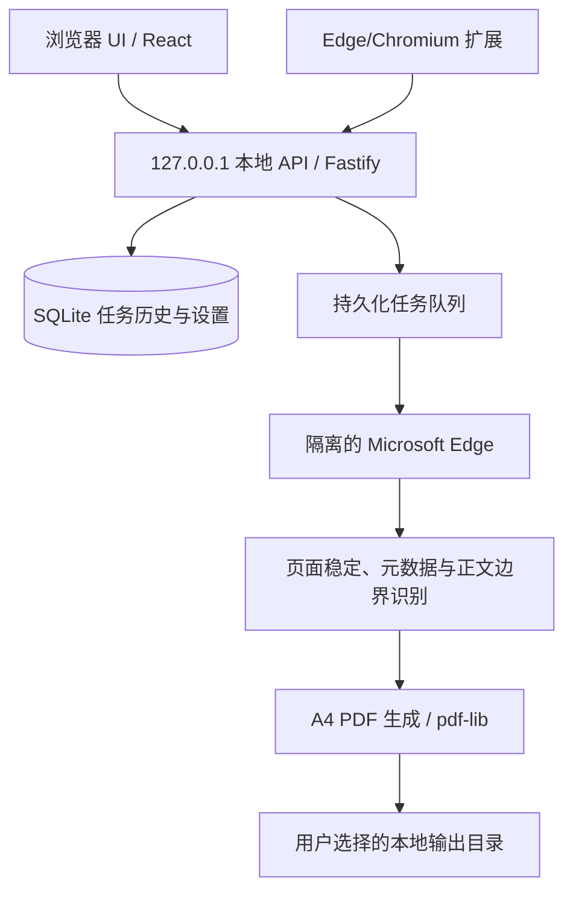

# 技术架构

宣传记录助手采用“桌面壳 + 本地服务 + 浏览器 UI + 系统 Edge 渲染”的本地架构。

## 模块职责

| 目录 | 作用 |
| --- | --- |
| `src/server` | 本地 API、任务队列、SQLite、Edge、元数据、截图、PDF 和安全校验 |
| `src/desktop` | Electron 进程、单实例控制和本地页面启动 |
| `src/shared` | 前后端共享类型和文件名规则 |
| `web` | React 浏览器操作界面 |
| `extension` | 依赖用户现有浏览器状态的离线采集兜底 |

## 主采集链路

1. 输入网址通过格式校验后写入 SQLite 队列。
2. Worker 为单个任务启动隔离 Edge 用户目录。
3. 页面滚动触发懒加载，等待字体、图片和高度稳定。
4. 按 JSON-LD、Open Graph、站点适配器与页面语义提取元数据。
5. 识别正文与可见子元素的联合边界。
6. 根据 A4 可打印比例与文字行边界计算截图切片。
7. 将高分辨率图片、二维码和页脚合成为 PDF。
8. 更新任务状态并把文件留在用户选择的目录。

## 扩展兜底链路

扩展使用 Chromium Debugger API 对当前标签页进行分段截图，通过带共享令牌的本机接口提交。服务端仍负责元数据、任务历史、PDF 合成和输出路径，因此两条链路的交付格式一致。

## 数据存储

- SQLite：任务、批次和设置；
- 文件系统：生成的 PDF；
- 临时 Edge 用户目录：单任务隔离，浏览器关闭后清理；
- 不存在远程数据库或项目自建云端 API。
